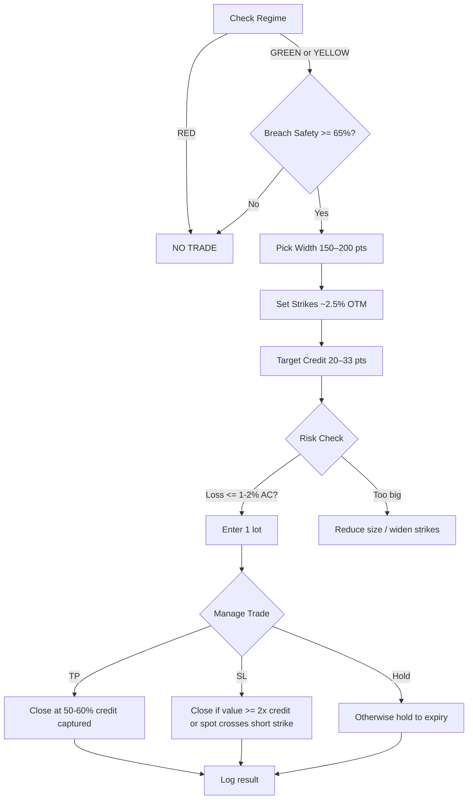

# Nifty Credit-Spread Playbook (Safer Band)

## Daily checklist
1. **Regime**: Must be GREEN or YELLOW. Skip RED.
2. **Safety**: Breach safety ≥65% on the side you sell.
3. **OTM distance**: ~2.5% below spot for bull put (vice‑versa for bear call).
4. **Width**: 150–200 pts.  
   - Max loss per lot ≈ (width – credit) × 65 ≈ ₹8–12k.
5. **Credit floor**:  
   - Width 150 → seek 20–26 pts.  
   - Width 200 → seek 24–33 pts.  
   Skip if below floor after slippage/fees.
6. **Position size**: 1 lot to start; ensure one loss <2% of account.
7. **Entries/day**: Cap ~5 new spreads to avoid stack risk.

## Management rules (suggested)
- **Take Profit (TP)**: close when 50–60% of credit is captured (spread value falls to 40–50% of entry credit).
- **Stop Loss (SL)**: close if spread value reaches 2× credit **or** spot touches the short strike.
- **Event filter**: skip major macro events (Budget, Fed, CPI) or VIX spikes.

## Backtest reference (safety 65%, no TP/SL yet)
- Width 150 / credit ~20–26 pts → ≈ ₹14k/month per lot; max loss ≈ ₹8.4k/lot.
- Width 200 / credit ~24–33 pts → ≈ ₹21k/month per lot; max loss ≈ ₹11.4k/lot.

## If you relax safety
- Safety 60% or 55% added trades but **reduced P&L** and increased drawdowns. Keep 65%.

## What to avoid
- **RED regime trades**: turning them on flipped P&L negative in tests.
- **Ultra‑wide (1,850 pt) spreads**: look great on paper, but a few losses erase months of profit.

## Next step (optional)
- Implement TP/SL in the backtester and rerun 150/20 and 200/24 to quantify impact on P&L and drawdowns.

---

# Dashboard How-To (Credit Spread Focus)

1) **Regime & Safety**  
   - Must be GREEN or YELLOW. Skip RED.  
   - Breach Radar side ≥65% = go/no-go for that side.

2) **Strike Selector**  
   - Width: 150–200 pts.  
   - OTM: ~2.5% from spot.  
   - Credit floors: 150→20–26 pts; 200→24–33 pts.

3) **Risk tiles** (size down/skip if “hot”)  
   - Tail Risk, Gap Risk, Max Drawdown, Volatility Crush, Range Width, Monthly Breach (only for 21/30d).

4) **Timing tiles**  
   - Favor selling when Theta Decay Day is positive and VIX Direction is flat/down.  
   - Intraday/PCR Reversal “hot” → expect whips; reduce size or skip.

5) **Macro tiles**  
   - Global Contagion / Macro Sentiment / Expiry Vol high → cut size or no-trade.

6) **Execution rules**  
   - Max ~5 new spreads/day.  
   - Size so one max loss <1–2% of account (150 width ≈ ₹8.4k; 200 width ≈ ₹11.4k per lot).  
   - TP: close at 60–70% credit captured.  
   - SL: close if spread ≈2× credit or spot tags short strike.  
   - Optional tail hedge: cheap far OTM put (for bull put) ~1–1.5% below long leg.

7) **Avoid**  
   - Trading through RED.  
   - Taking signals with credit below floor.  
   - Ultra-wide structures unless you accept rare but large losses.
